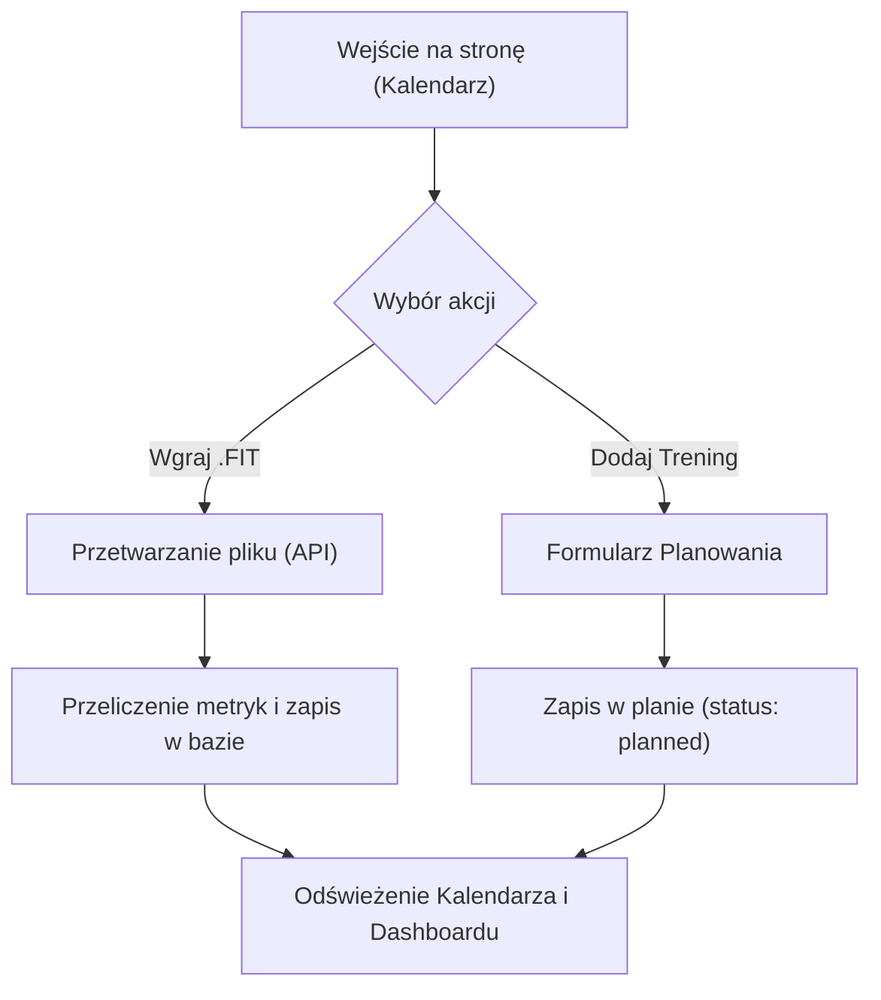

## 1. Przegląd Produktu
Treningowy Asystent Kolarza to aplikacja wspierająca kolarzy w analizie i planowaniu treningów, z docelową integracją AI do tworzenia adaptacyjnych planów (Hybrid AI).
- Główne cele to monitorowanie obciążeń (TSS, ATL, CTL, TSB), automatyzacja po imporcie treningów z plików `.FIT` i ułatwienie zarządzania kalendarzem.
- Narzędzie typu single-athlete, bez rejestracji i logowania.

## 2. Główne Funkcjonalności

### 2.1 Moduły Funkcjonalne
1. **Profil Kolarza**: formularz konfiguracji parametrów bazowych (FTP, waga, strefy HR).
2. **Dashboard / Kalendarz**: widok tygodniowy/miesięczny (FullCalendar) wyświetlający zaplanowane i wykonane treningi.
3. **Import Treningów**: możliwość uploadu plików `.FIT` z wizualnym feedbackiem.
4. **Historia Treningów**: lista odbytych sesji ze szczegółami analitycznymi.

### 2.2 Szczegóły Stron
| Nazwa Strony | Nazwa Modułu | Opis Funkcjonalności |
|--------------|--------------|----------------------|
| Profil | Konfiguracja Kolarza | Edycja FTP, wagi, preferencji czasowych i sprzętowych (indoor/outdoor) |
| Kalendarz | Główny Dashboard | Zarządzanie mikrocyklem; dodawanie, przesuwanie (drag & drop) jednostek |
| Lista Treningów | Historia Sesji | Tabela odbytych jazd z szybkimi metrykami: TSS, IF, NP, Czas |

## 3. Główny Proces
Główny przepływ: Użytkownik wchodzi na aplikację i widzi kalendarz. Może dodać nowy trening do planu lub wgrać plik `.FIT`, co automatycznie przetworzy dane, obliczy obciążenia i zaktualizuje metryki formy sportowej (CTL, ATL, TSB).

## 4. Projekt Interfejsu Użytkownika

### 4.1 Styl Projektowania
- **Styl**: Nowoczesny, analityczny, "sport tech" (inspiracja Garmin Connect / TrainerRoad) z naciskiem na czytelność danych i wyraziste akcenty.
- **Kolory**: 
  - Tło: Ciemny motyw jako domyślny (Dark Mode), np. grafit `#111827` lub głęboki granat `#0f172a`.
  - Akcenty: Jaskrawy, sportowy pomarańcz/neonowy żółty (dla kluczowych CTA i akcentów).
  - Statusy: Wyraźne kolory stref (Z1: szary, Z2: niebieski, Z3: zielony, Z4: żółty, Z5: pomarańczowy, Z6: czerwony).
- **Czcionki**: Zdecydowany krój bezszeryfowy, np. *Oswald* (do nagłówków i danych liczbowych) oraz *Inter* (dla czytelności w tabelach i UI).
- **Układ**: Oparty na kartach z dużą ilością "oddechu" (negative space). Komponenty wyizolowane na delikatnych tłach z lekkim efektem glassmorphism.

### 4.2 Przegląd Projektu Stron
| Nazwa Strony | Nazwa Modułu | Elementy UI |
|--------------|--------------|-------------|
| Kalendarz | Dashboard | Pełnoekranowy widok siatki z etykietami. Elementy drag&drop, modale (dialogi) z detalami treningów. |
| Profil | Ustawienia | Minimalistyczny formularz z dużymi polami wprowadzania. |
| Import FIT | Upload | Strefa drag&drop z animacją wczytywania pliku. |

### 4.3 Responsywność
Aplikacja projektowana domyślnie pod środowisko desktop (Desktop-first), aby wygodnie zarządzać analityką, ale adaptująca się do układu mobilnego (widok pojedynczej kolumny na smartfonie, mniejszy kalendarz z listą pionową na dany dzień).