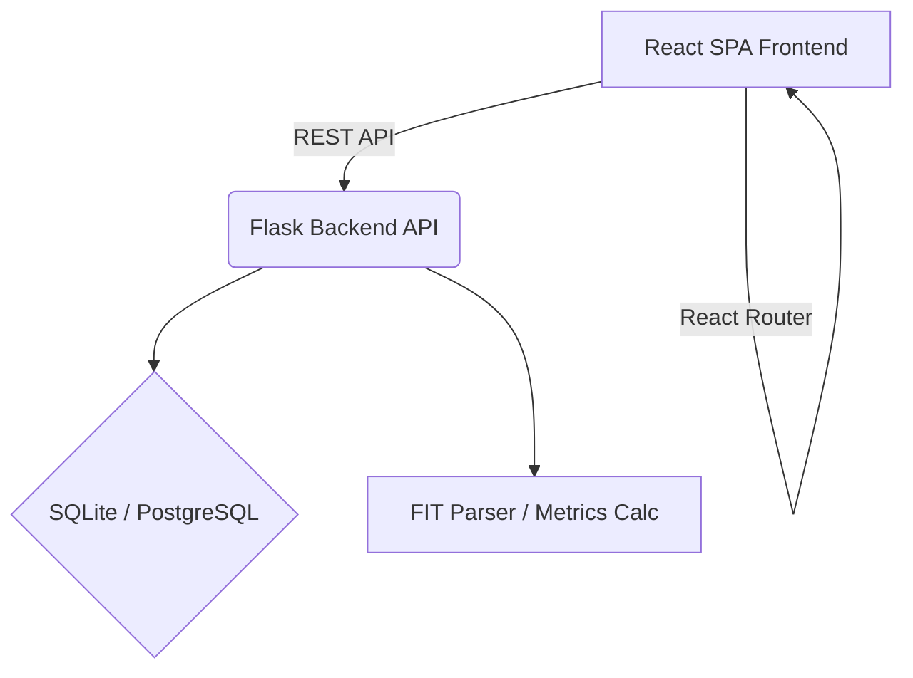
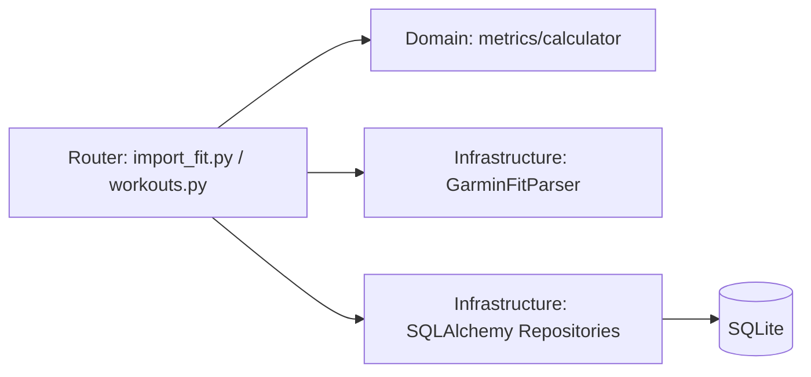
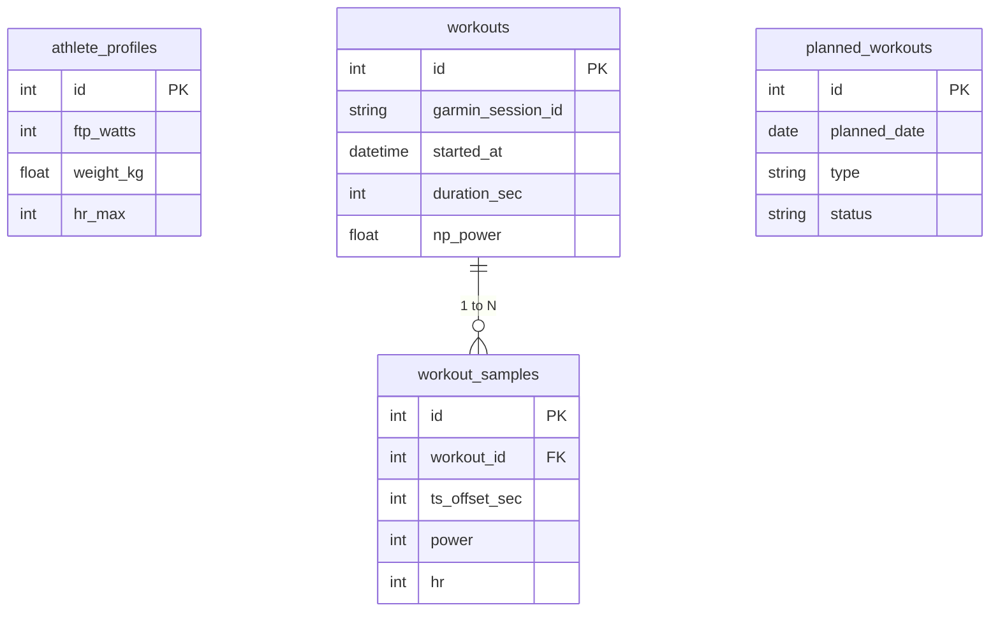

## 1. Projekt Architektury
Architektura rozdzielona na Backend w Pythonie (dostarczający REST API dla zarządzania plikami `.FIT` i modelem analitycznym) oraz nowoczesny Frontend zoptymalizowany pod responsywne Single Page Application.



## 2. Opis Technologii
- **Frontend**: React@18 + tailwindcss@3 + vite
- **Stan i API**: `@tanstack/react-query`, `axios`
- **UI i Wizualizacja**: `fullcalendar` (dla kalendarza), `lucide-react` (ikony), `@radix-ui/react-dialog` (modale)
- **Stylowanie**: Tailwind CSS + custom CSS variables
- **Inicjalizacja Narzędzi**: vite-init z TypeScript
- **Backend (istniejący)**: Python 3.11, Flask, SQLAlchemy 2.x
- **Baza danych**: SQLite (zgodnie z wymaganiami środowiska jednoosobowego)

## 3. Definicje Ścieżek
| Ścieżka | Cel |
|---------|-----|
| `/` | Główny dashboard / Kalendarz treningowy |
| `/workouts` | Lista i historia wszystkich wgranych treningów |
| `/profile` | Konfiguracja profilu sportowca (FTP, Waga, HR, Cele) |
| `/import` | Ekran dedykowany do wgrywania `.FIT` |

## 4. Definicje API (Kontrakty dla Frontendu)
```typescript
// Profile
interface Profile {
  ftp_watts: number;
  weight_kg: number;
  hr_max: number;
  hr_threshold: number;
  experience_level: 'beginner' | 'intermediate' | 'advanced';
  weekly_hours: number;
  goals: string;
  preferred_training_days: string;
  max_ride_time_per_day_min: number;
  indoor_vs_outdoor_preference: 'indoor' | 'outdoor' | 'mixed';
}

// Workout (Zrealizowany)
interface Workout {
  id: number;
  source: string;
  started_at: string;
  duration_sec: number;
  distance_m: number;
  avg_power: number;
  np_power: number;
  if_value: number;
  tss: number;
  avg_hr: number;
  max_hr: number;
  avg_cadence: number;
  type: 'completed';
}

// Planned Workout
interface PlannedWorkout {
  id: number;
  planned_date: string;
  type: string;
  duration_sec: number;
  target_zone: string;
  status: 'planned' | 'completed' | 'skipped' | 'moved';
  moved_from_date?: string;
  notes?: string;
}

// API Endpoints:
// GET /api/v1/profile -> Profile
// PUT /api/v1/profile -> Profile
// POST /api/v1/workouts/import-fit -> { file_hash, header, samples_count, metrics }
// GET /api/v1/calendar?from=...&to=... -> { planned: PlannedWorkout[], completed: Workout[] }
// GET /api/v1/workouts -> Workout[] // [Do zaimplementowania na BE]
// POST /api/v1/planned-workouts -> PlannedWorkout
// PATCH /api/v1/planned-workouts/:id/status -> PlannedWorkout
```

## 5. Diagram Architektury Serwera (Flask)


## 6. Model Danych (Uzupełnienie istniejącego)
### 6.1 Definicja Modelu Danych (Backend - istniejace modele)

